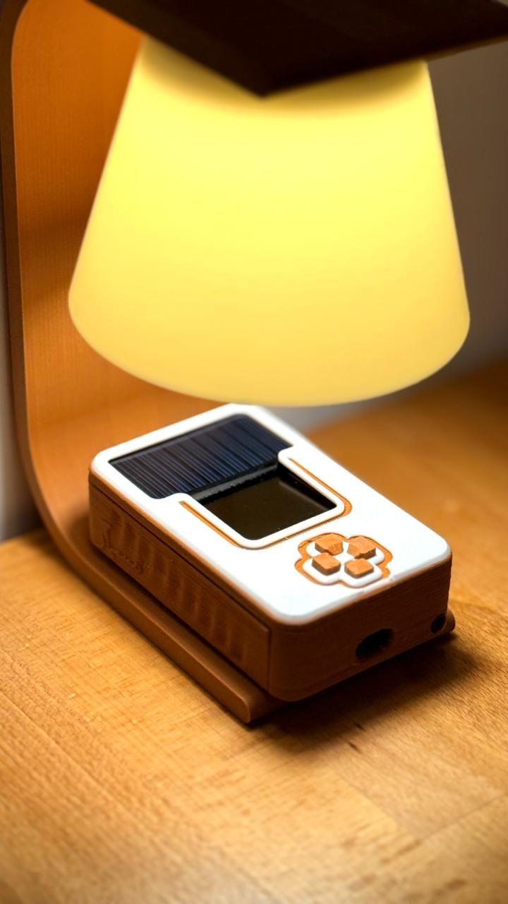
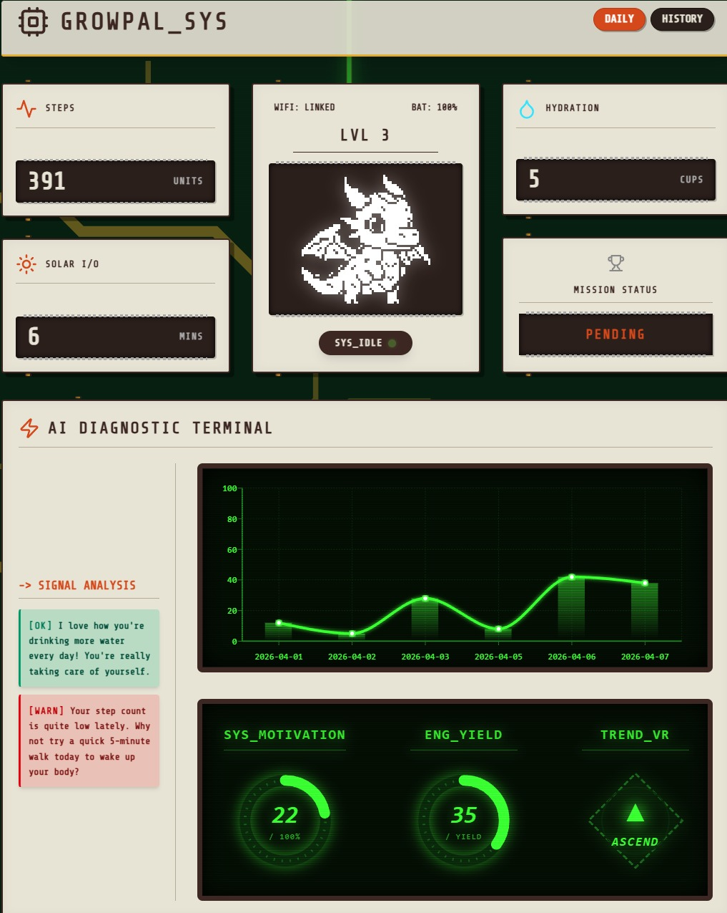

  <h1>🌱 GrowPal: Gamified Health Companion</h1>
  
<i>A Tamagotchi-inspired ESP32 wearable that rewards healthy habits with digital pet progression.</i>

  
  

    <a href="https://mbagosher.wixsite.com/final-year-project">Read the Dev Blog</a> | 
    <a href="https://grow-pal.vercel.app/">Live Dashboard UI</a>
  

---

  
_The assembled Seeed Studio Xiao ESP32-S3 powering the GrowPal hardware._

  
_The web-based React/Vite companion dashboard with retro CRT stylings._

---

## 🛠️ Hardware & Firmware Architecture

The GrowPal firmware (`Growpal_firmware_1.0.ino`) was purpose-built around power efficiency, utilizing a robust Deep Sleep engine to ensure all-day battery life on a compact Seeed Studio XIAO ESP32-S3 module alongside a 1000mAH LiPo battery.

### Core Components used:

- **Microcontroller:** Seeed Studio Xiao ESP32-S3
- **Display:** 128x128 OLED (SH1107 driver)
- **Step Tracking:** BMI160 6-Axis IMU
- **Sunlight Tracking:** Mini Solar Panel + INA219
- **Audio:** Passive Buzzer (using `ledc` PWM driver)

### 🚀 Advanced Firmware Features

#### 🔌 Bare-Metal BMI160 Step Counting

To prevent battery drain from constant polling, the BMI160 is managed via direct bare-metal I2C register writes. During Deep Sleep, the sensor is kept at a minimal current draw (~180µA) with its internal hardware step counter left **active**. The ESP32 wakes up periodically, grabs the hardware register difference (`0x78` and `0x79`), and logs it—ignoring the need for constant main CPU cycle tracking.

#### ☀️ Hacked INA219 Solar Sunlight Sensor

Instead of a standard light dependent resistor (LDR) which varies inconsistently, GrowPal utilizes a mini solar panel wired directly through a high-precision **INA219 Current Sensor**. By measuring the short-circuit current across a 100-ohm resistor, the firmware definitively gauges UV/sunlight exposure.

- Current < 2mA = Indoor lighting
- Current > 10mA = Direct outdoor sunlight (triggers progression goal)

#### 🔋 Ultra-Low Power & Sleep Engine

The ESP32 manages aggressive deep-sleep cycles. During low activity periods, it turns off the OLED display, disables unused peripherals, puts the INA219 manually into `powerSave(true)` (dropping consumption from 1mA to 6µA), and drops into hardware deep sleep. It is awakened only by a hardware timer.

#### ☁️ Smart WiFi & Firebase Syncing

GrowPal does not continuously stay connected to WiFi to save battery. It manages network connectivity intelligently:

1. **10:00 PM Sync:** Wakes up silently, connects to WiFi via the saved `WiFiManager` portal, syncs `time.h` via an NTP server (to fix any sleep drift), patches the Firebase Firestore database with the day's total logs, and goes back to sleep.
2. **10:00 AM Fix:** Uses the NTP server simply to correct the internal RTC clock if power loss compromised the Unix timestamp.

---

## 🎮 Gamification & RPG Mechanics

At the heart of GrowPal is an interactive progression engine that tracks your real-life health metrics locally.

- **The Pet System:** The character evolves from an Egg (Level 0) to a fully-grown Dragon (Level 6), requiring 350 XP per level.
- **Dynamic Difficulty:** As your pet levels up, your physical goals increase linearly!
  - Step Goals = `500 + (Level * 1000)`
  - Sun Minutes = `2 + (Level * 2)`
  - Water Intake = `2 + Level (cups)`
- **Missions & Rewards:** You get 100 XP for completing a daily task (Steps, Water, Sun) and a 50 XP Bonus if all three are finished.
- **Punishments:** Failing to meet daily requirements slowly drains the XP bar. Falling below 0 bumps the pet down to the previous level!

### 🔊 Audio Feedback

A lightweight `MelodyManager` controls a passive buzzer, featuring retro square-wave arpeggios that play when the user unlocks an achievement, successfully drinks water, or interacts via the onboard directional button menus.

---

## 💻 Included Files

- `/Firmware_v1.0/`
  - `Growpal_firmware_1.0.ino` - The central operating loop and Deep Sleep logic.
  - `StepCounter.h / .cpp` - Bare metal interfacing for the BMI160 IMU hardware step engine.
  - `SunlightSensor.h / .cpp` - Advanced logic using an INA219 current sensor to map sunlight intensity precisely via solar panel output.
  - `Assets.h` - Contains the hexadecimal byte arrays defining the 1-bit pixel art of the Tamagotchi character states shown on the OLED.
- `/website/` - The React, Vite, and Tailwind CSS web GUI. Connects directly to Google Firebase to visualize historical and live data from the ESP32.

---

## 🔗 How to use it manually

If you're building this project yourself, you will need the Arduino IDE with the ESP32-S3 boards installed. Open the `.ino` file and ensure the credentials at the very top (Firebase Project ID and API Key) are filled out to enable cloud syncing.

Made for a healthier lifestyle.

